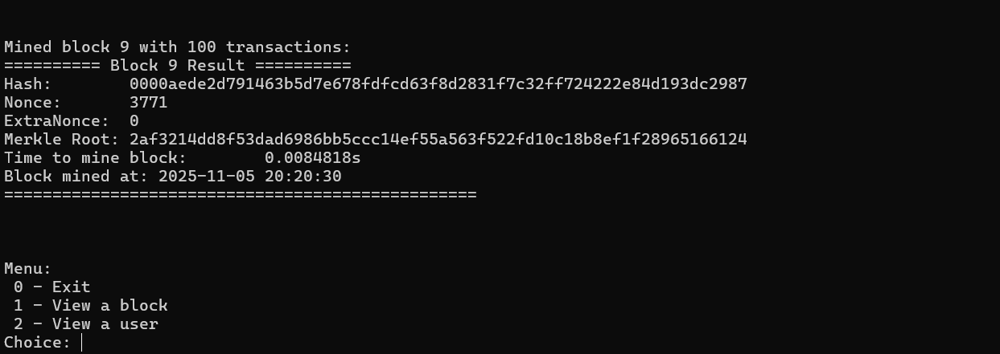
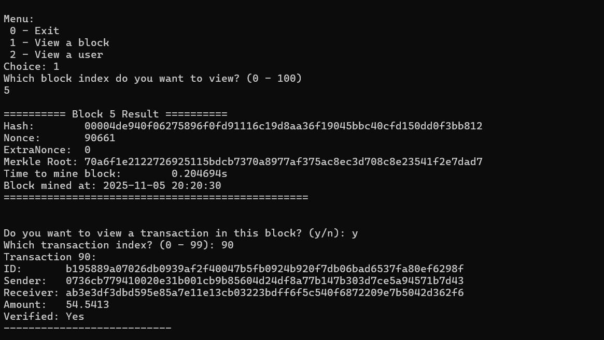

# Supaprastintos blokų grandinės kūrimas

## Naudojimo instrukcijos
* Paleiskite **main.exe**
* Iveskite hasho sunkumą
* Programa pradės kasimą (tik pirmi 10 blokų bus išvesti ekrane)
* Baigus kasti visus blokus atsiras meniu, kuriuo galesite pažiūrėti betkurio bloko ar vartotojo duomenis




## Programos veikimas
* Sugeneruojama atsitiktiniai 1000 vartotojų ir 10000 transakcijų:
```
vector<User> users;
generateUsers(users, 1000);
vector<Transaction> transactions;
generateTransactions(users, transactions, 10000);
```
* Sukuriamas 'genesis' blokas
```
Block genesis;
blocks.push_back(genesis);
```
```
 // genesis block constructor
    Block()
    : index(0),
      previous_hash(string(64, '0')), // 64 zeros
      nonce(0),
      extraNonce(0),
      timestamp(static_cast<uint64_t>(time(0))),
      blockMinedTime(0),
      mineTime(0.0)
{
    //genesis transaction
    Transaction genesisTx("0", "SYSTEM", "ALL", 0.0, true);
    transactions.push_back(genesisTx);

    merkle_root = computeMerkleRoot(transactions);
    block_hash = headerHash();
}
```
* Pradedamas blokų kasimas iki kol baigsis transakcijos
```
Block blk(blockIndex, prev_hash, batch, batch.size());
blk.mine(difficulty);
```
```
// mine until hash meets difficulty
bool mine(int difficulty) {
    if (difficulty < 0) difficulty = 0;
    string target(difficulty, '0');
    const uint64_t MAX_NONCE = numeric_limits<uint64_t>::max();

    auto t0 = chrono::high_resolution_clock::now();
    while (true) {
        block_hash = headerHash();

        // check if hash starts with 4 zeros
        if (block_hash.rfind(target, 0) == 0) {
            auto t1 = chrono::high_resolution_clock::now();
            chrono::duration<double> elapsed = t1 - t0;
            mineTime = elapsed.count();
            blockMinedTime = static_cast<uint64_t>(time(0));
            return true;
        }

        ++nonce;

        if (nonce >= MAX_NONCE) {
            nonce = 0;
            ++extraNonce;
        }
    }
}
```
* Baigus bloko kasimui, jo transakcijos yra patvirtinamos ir ivykdomos, ir veliau ištrinamos iš bendro transactions pool
```
blk.applyTransactions(users);
```
```
transactions.erase(transactions.begin(), transactions.begin() + take);
```


# DI pagalba
* Pagerint maišos funkciją
* 'Meniu'/ išvesties patobulimai
* 


